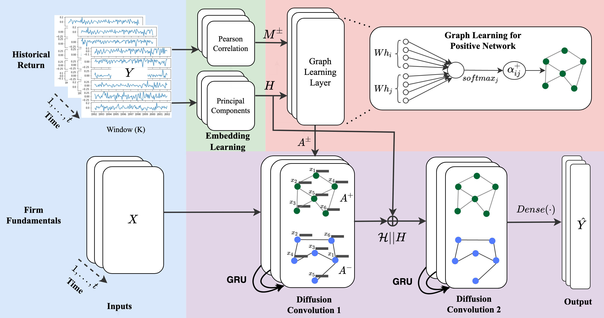

# Attention_GNN_GFJ
 Python Implementation of the Paper "Attention based dynamic graph neural network for asset pricing" -Published in Global Finance Journal

# Attention based dynamic graph neural network for asset pricing
This is a tensorflow-keras implementation of our Global Finance Journal paper [**"Attention based dynamic graph neural network for asset pricing"**](https://doi.org/10.1016/j.gfj.2023.100900)

 

### **Requirments** 
- numpy >= 1.19
- pandas >= 1.0.1
- sckitlearn >= 0.22.0
- matplotlib >= 3.1.0
- pyreadr >= 0.4.0
- tensorflow == 2.5.0
- keres == 2.3.1

### **DATA** 

### The Model

### Citation

  
